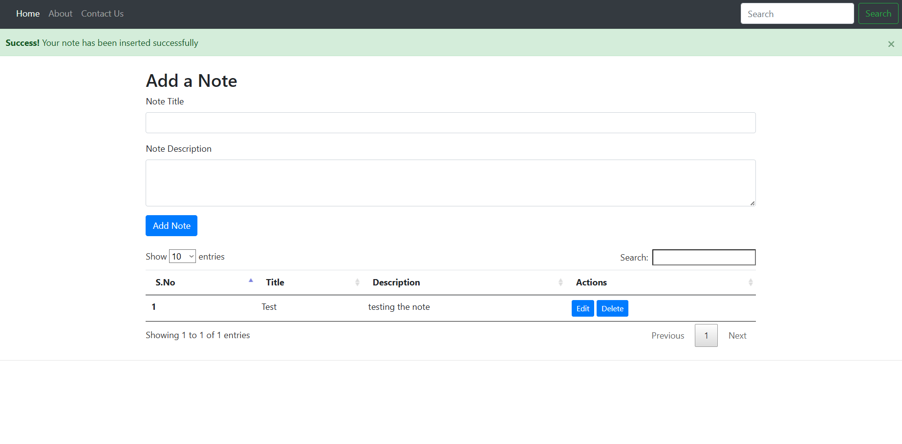

# PHP CRUD App

A simple PHP CRUD (Create, Read, Update, Delete) application for managing records in a MySQL database. This project demonstrates core PHP with MySQLi and Bootstrap to build a user-friendly interface for managing data.

## 🚀 Features

- Add new records
- Edit existing records
- Delete records
- View all records in a tabular format
- Bootstrap for responsive UI

## 📸 Screenshots


> 

## 🛠️ Tech Stack

- PHP
- MySQL
- Bootstrap
- HTML/CSS

## 📁 Folder Structure

crud/
├── index.php           # Main page listing all records
├── insert.php          # Logic to insert a record
├── update.php          # Logic to update a record
├── delete.php          # Logic to delete a record
├── \_dbconnect.php      # Database connection file
└── style.css           # (Optional) Custom styles


## ⚙️ How to Use

1. Clone the repository:


git clone https://github.com/vishwasgh/php-crud-app.git


2. Place the project in your XAMPP `htdocs` folder:


C:\xampp\htdocs\php-crud-app


3. Start Apache and MySQL from XAMPP Control Panel.

4. Create the database:

   * Open **phpMyAdmin** at: [http://localhost/phpmyadmin](http://localhost/phpmyadmin)
   * Create a new database, e.g., `crud`
   * Import the SQL file (`crud.sql` if available) or manually create the table:

```sql
CREATE TABLE `notes` (
  `sno` INT(11) NOT NULL AUTO_INCREMENT,
  `title` VARCHAR(255) NOT NULL,
  `description` TEXT NOT NULL,
  `tstamp` DATETIME NOT NULL DEFAULT CURRENT_TIMESTAMP,
  PRIMARY KEY (`sno`)
);
```

5. Visit the app in your browser:

```
http://localhost/php-crud-app
```

## 🙏 Acknowledgements

This project is based on the tutorial by [CodeWithHarry](https://www.youtube.com/@CodeWithHarry).


